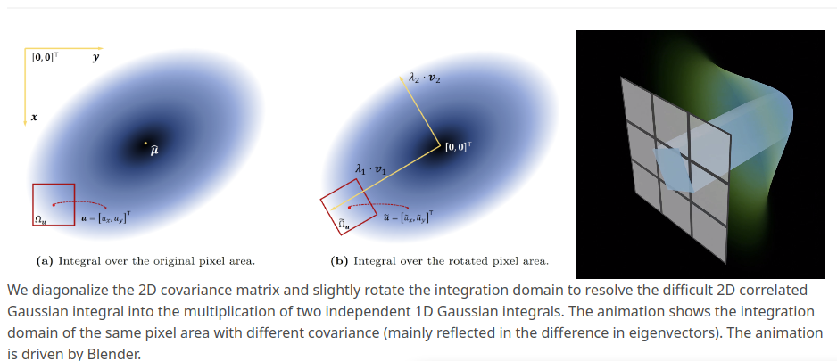
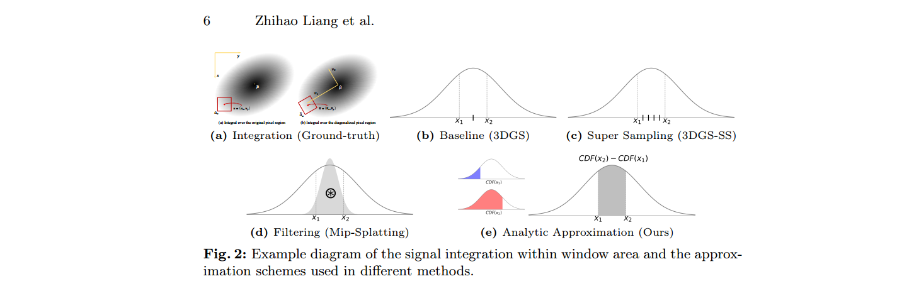

### Analytic-Splatting: Anti-Aliased 3D Gaussian Splatting via Analytic Integration

Project page: https://lzhnb.github.io/project-pages/analytic-splatting/

**Background**

3D Gaussian rasterization rendering at varying resolution could produce server blurring or jaggies. This is because 3dgs tread **eash pixel as an isolated, single point rather than as an area**, causing insensitivity to changes in the footprint of pixels. 

MipSplatting [36] employs the prefiltering technique and presents a hybrid filtering mechanism to regularize the high-frequency components of 2D and 3D Gaussians to achieve anti-aliasing. While Mip-Splatting overcomes most aliasing in 3DGS, it is limited in capturing details and synthesizes over-smoothing results.

Consequently, solving the integral of Gaussian signals within the pixel window area as intensity responses is crucial for both anti-aliasing and capturing details.

