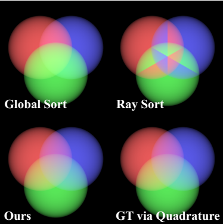
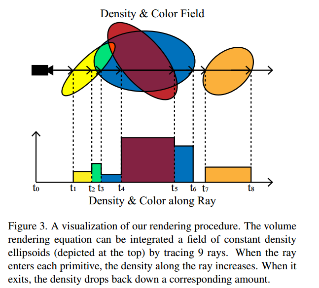
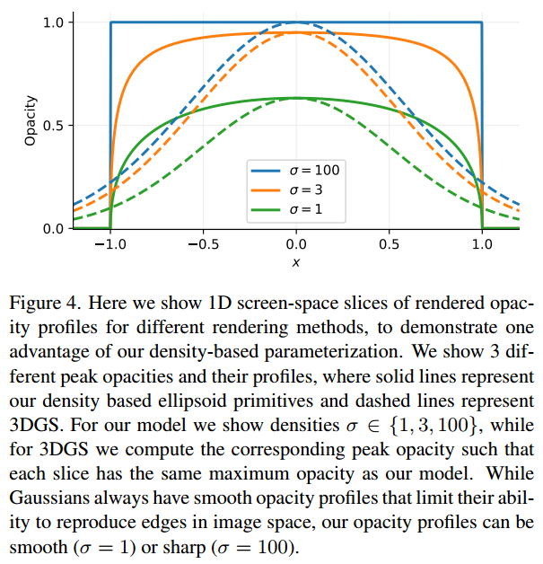
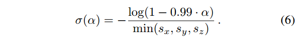

### EVER: Exact Volumetric Ellipsoid Rendering for Real-time View Synthesis

**Background:** 

Popping results from how 3DGS sorts Gaussians once per-frame using their mean, and it has been partly addressed by StopThePop [34] during rasterization and 3DGRT [30] during ray-tracing. However, StopThePop only approximately sorts per-ray, and both StopThePop and 3DGRT ignore overlap between the primitives.	

When the primitives are sorted per a view, the color between the primitives do not mix to produce purple, yellow, and blue green, but the appearance is smooth. When the primitives are sorted per a ray, the order changes throughout the image, causing lines to appear.

 

**Method:**

 Exact Primitive-based Rendering:

1. First, while 3DGS Gaussians are treated as 2D “billboards”, our ellipsoids interact with each other so as to constitute a proper and consistent 3D radiance field.

2. Second, while the 2D opacity profile of the primitives used in 3DGS always has a smooth Gaussian falloff, the 2D opacity profile of
   one of our ellipsoidal primitives can range from extremely smooth to a perfect step function in the limit of infinite density. 

Density Parameterization:	

Optimizing challenge: as the density of a primitive grows and its opacity approaches 1, the gradient used for updating the parameters of the primitive approaches 0 and would require special treatment [25]. Intuitively, this is because the outside of the primitive becomes opaque.

**Implementation**

using 3DGRT[30] to ray trace through the primitives and to provide a per-ray sorting of distances.

benefit: Ray tracing allows for effects like fisheye projection and defocus blur as well as random pixel offsets during training