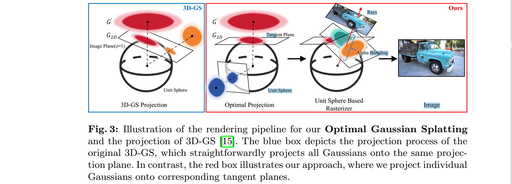

### On the Error Analysis of 3D Gaussian Splattingand an Optimal Projection Strategy

**Background**

projection errors introduced by the local affine approximation inherent in the splatting itself, and the consequential impact of these errors on the quality of photo-realistic rendering.

 3D Gaussian Splatting adopts a local affine approximation [44], specifically approximating the projection function with the first two terms of its Taylor expansion. Nevertheless, approximations introduce errors, and the local affine approximation
similarly contributes to these errors which may lead to artifacts in the rendered images. 

They discover that the error function attains its minimum value when the projection of the Gaussian mean on the plane coincides with the projection from the camera center to the plane. 

**Method**

Based on the directions from each Gaussian mean to the camera center instead of naively projecting all Gaussians onto the same plane, propose a novel optimal projection capable of adapting to diverse camera models that adopts different tangent plane projections