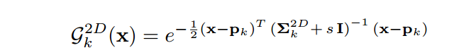
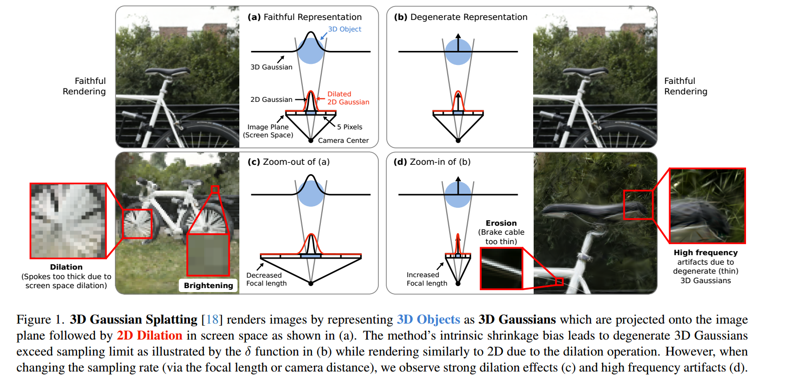
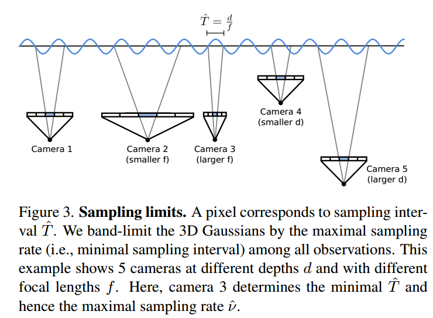
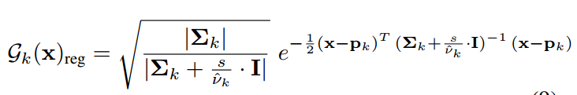
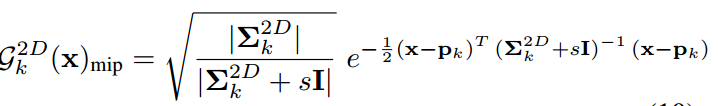

### Mip-Splatting: Alias-free 3D Gaussian Splatting

**Background**

在二维像素平面,不同分辨率下,存在固定的膨胀系数, 在低分辨率平面下会导致小的高斯球占用过多的像素跚格,称之为膨胀,发生混叠或伪影.在高分辨率下,小的高斯球占用的像素跚格

**Q: 为什么需要进行膨胀?** 难道是像素栅格分辨率导致的问题?

**Sampling Rate**

Given the maximal sampling rate νˆk for a primitive, we aim to constrain the maximal frequency of the 3D representation. This is achieved by applying a Gaussian low-pass filter Glow to each 3D Gaussian primitive Gk before projecting it onto screen space:

> Q1: v_k 由相机到高斯球中心的距离和相机焦距决定, 跟高斯球大小不存在关系,相同位置,不同大小的高斯球,收到的约束一样,这个低通滤波器表现在哪里? 对小高斯(高频)球的影响是? 当相机视角拉近或拉远对他有什么影响?

2D Mip Filter

To avoid degenerate cases where the projected 2D Gaussians are too small in screen space, i.e., smaller than a pixel, the projected 2D Gaussians are dilated as follows:

> Q1: in (d), 焦距拉长,单位像素内落入的高斯球变少,单个高斯球占用像素平面变大, 是什么原因导致的腐蚀现象?

While this does not affect rendering at similar sampling rates (cf. Figure 1 (a) vs. (b)), it leads to erosion effects when zooming in or moving the camera closer. This is because the dilated 2D Gaussians become smaller in screen space. 

> Q2: in (c), 焦距变短, 单位像素内容纳更多高斯球, 单个高斯球占用像素平面变小,多个高斯球融合出来的颜色有问题吗?

