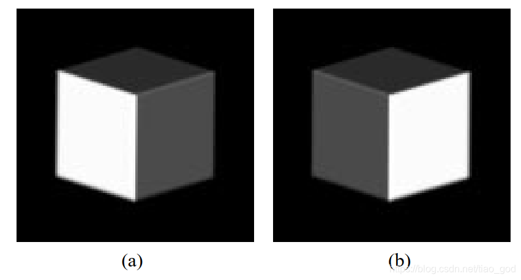
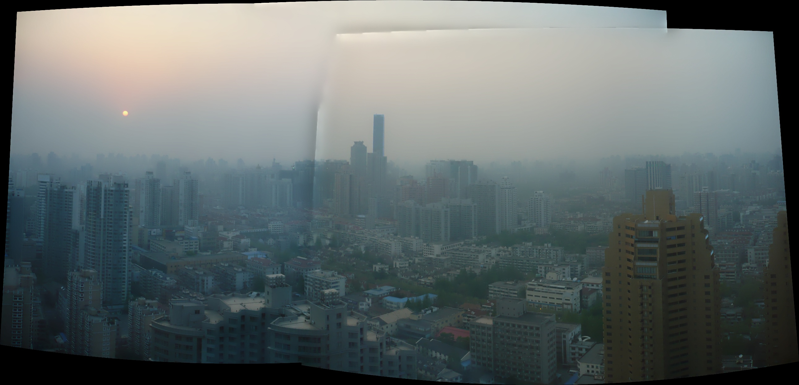
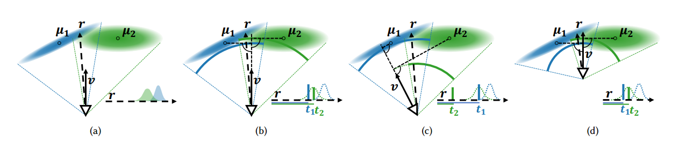
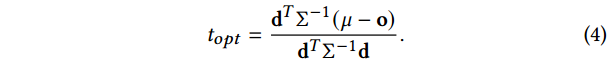
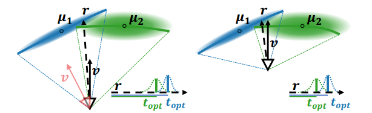
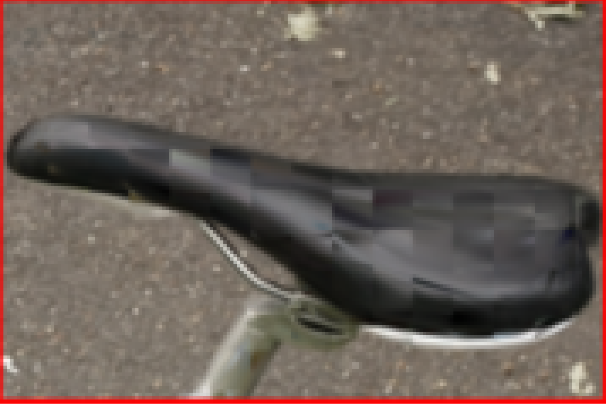
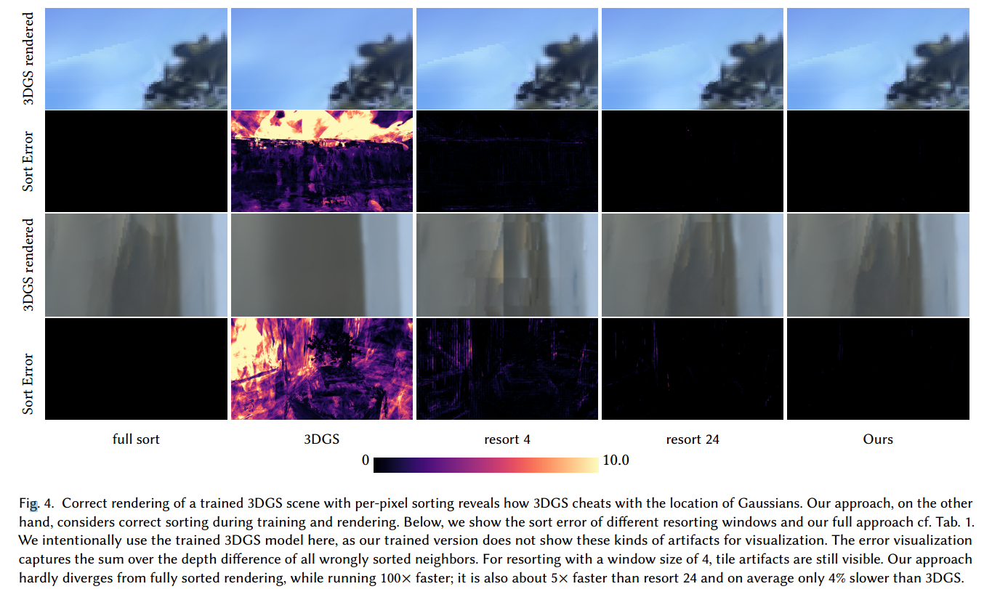
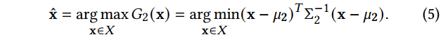

### StopThePop: Sorted Gaussian Splatting for View-Consistent Real-time Rendering

**Background**

reducing Gaussian to 2D splats with a single viewspace depth introduces **popping and blending artifacts** during view rotation.

> note: 
>
> popping artifacts: 是指在渲染图像时，由于不同细节层次（LOD）之间的突然切换，导致视觉上的突变或闪烁现象
>
> blending artifacts: 在图像合成过程中，由于不同图像区域之间的过渡处理不当，导致在合成图像中出现的视觉不一致性或不自然的效果
>
>  

3DGS approximates them as flattened 2D splats(EWA) necessitating depth-based sorting for rendering

We propose a novel 3D Gaussian Splatting rendering pipeline that exploits coherence among neighboring view rays on multiple hierarchy levels, interleaving culling, depth evaluation and resorting

Utilizing fast per-pixel depth calculations and a hierarchical intra-tile cooperative sorting approach, our method enhances the accuracy of the resulting sort order. 	

**Per-Pixel Depth sorting**

When replacing a 1D Gaussian along the view ray with a Dirac impulse, the mean/maximum of this 1D Gaussian is arguably the best discrete blend location. 

tips: When reconstructing surfaces, Gaussians often turn very flat, as such, Σ−1 may become large and lead to instabilities in the computation. Bounding the entries of 𝑆−1 to 103 removes those instabilities in our experiments, by effectively thickening very thin Gaussians, with minimal impact on the computed depth

result: 

1. With the computation of 𝑡𝑜𝑝𝑡 in place, we can eliminate all popping artifacts and ensure perfect view-consistency by sorting all Gaussians per ray by their 𝑡𝑜𝑝𝑡 value.

2. Even an optimized parallel per-ray sort on top of the original 3DGS tile-based rasterizer leads to slowdowns of more than 100×, not only making the approach impractical for real-time rendering, but also impeding optimization.

**Per-tile Sorting and Local Resorting**

reason: we may still rely on the fact that 𝑡𝑜𝑝𝑡 is smooth across neighboring rays.

result: using the tile center ray. As can be seen in Fig. 5, using per-tile depth clearly leads to artifacts along the tile borders

reason : resort window

experiment: Instead of immediately blending the next Gaussian when walking through the tile list, we keep a small resorting window in registers. 

result: Although this sorting strategy is easy to implement, it already achieves good results for a resorting window of about 16 to 24, removing the majority of visible popping artifacts in our tested scenes

**Hierarchical Rendering**

sort hierarchy: share sorting efforts between neighboring rays, while incrementally refining the sort order as we move towards individual rays. 

reduce cost: culling non-contributing Gaussians at every level of the hierarchy

**Tile-based culling:** disregard Gaussians with a contribution below 𝜖𝑂 = 1/255, which forms an exact culling condition

