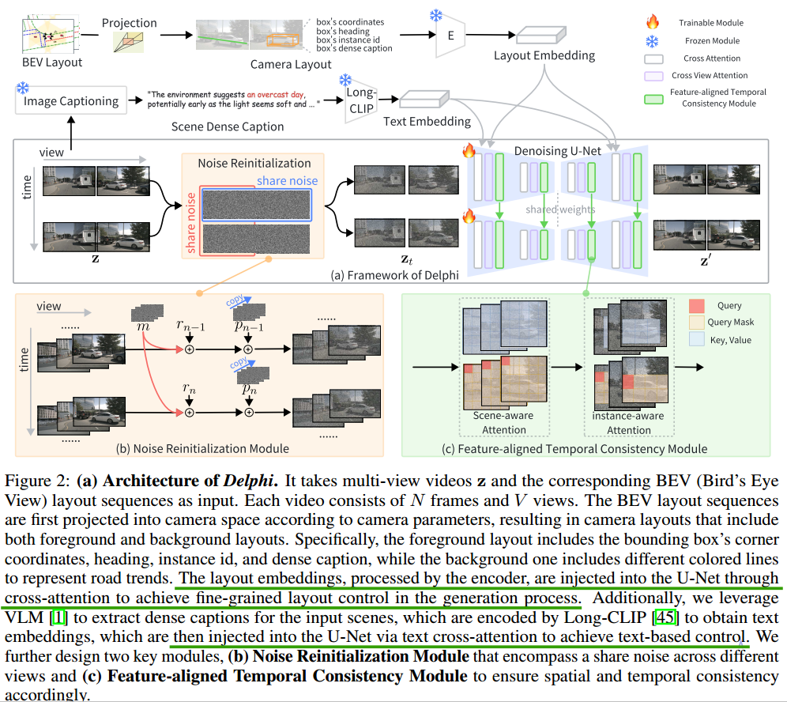

### Unleashing Generalization of End-to-End Autonomous Driving with Controllable Long Video Generation

**Background**

Though existing approaches are able to boost perception models, we discover that these approaches fail to improve the performance of planning of end-to-end autonomous driving models as he generated videos are usually less than 8 frames and the spatial and temporal inconsistencies are not negligible:

i) adding independent noise to different views and does not consider the cross-view consistency;

ii) exploiting a simple cross attention to fuse multiple feature spaces with different reception fields. 

**Method** 

Delphi, a novel diffusion-based long video generation method with a shared noise modeling mechanism across the multi-views to increase spatial consistency, and a feature-aligned module to achieves both precise controllability and temporal consistency.

通过这种方式生成的视频序列我是否可以将其理解成一种隐式表达？ 

对于3dgs是切切实实构建出一个三维空间， 而相对于Delphi中的layout，同样存在一个不是那么直接的空间

希望可以做到的是万物归一的一种形态

如果将其从Denoising U-net这里分开，那么从U-net这里往后，整体都为一致的，剩下的需要着重考虑输入

输入： Layout Embedding\Noising Image\TextEmbedding

输入可以并行的增加或删补，通过3d gaussian渲染出来的图像对齐进行nosing image generation或者对origin image进行nosing都可以

